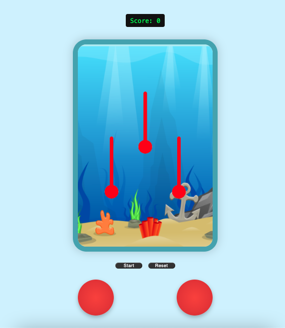
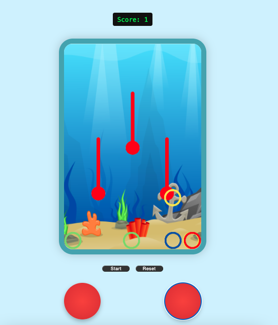

# Aqua Rings
---

## Introducción
---
¡Bienvenido a *Aqua Rings*! Este juego está inspirado en el clásico juguete de agua con anillos, ofreciendo una experiencia nostálgica y divertida. Esta aplicación cuenta con varias características clave:

- **Lenguaje de programación**: Desarrollado con JavaScript, utilizando HTML para la estructura y CSS para los estilos visuales.
- **Motor de juego**: Se utiliza **Phaser**, un framework poderoso para crear juegos en 2D de manera sencilla y eficiente.
- **Interfaz de usuario**: La interacción se realiza mediante botones visibles en pantalla que simulan los controles del juguete original.
- **Lógica del juego**: Al iniciar, se generan 12 anillos que deben ser lanzados hacia las púas mediante los botones. El objetivo es colocar todos los anillos correctamente.

La dinámica se centra en simular la física del agua y el movimiento de los anillos como en el juguete real.

> 🎨 El diseño está inspirado en el juguete *Aqua Rings*, y todos los derechos pertenecen al creador original. Esta aplicación fue creada con fines educativos y no tiene intención comercial.

## 📸 Capturas de pantalla
---
A continuación se muestran algunas capturas de pantalla del juego *Aqua Rings*:

### Pantalla de inicio

### Juego en progreso

## Requisitos
---
- Navegador web (Chrome, Firefox, Edge, etc.).
- Conexión a internet.

---

## Cómo ejecutar de manera local
---
1. Clona el repositorio en tu máquina local.
2. Asegurarse de contar con la versión 22.15.0 de Node.
3. Ejecutar el comando 'npm install' para instalar las dependencias necesarias.
4. Ir al archivo 'main.js' en la carpeta 'src' y comentar la linea '4' antes de ejecutar el paso siguiente.
4. Ejecutar el comando 'npm start'.
5. Acceder a 'http://localhost:3000'.
3. ¡Empieza a jugar!

